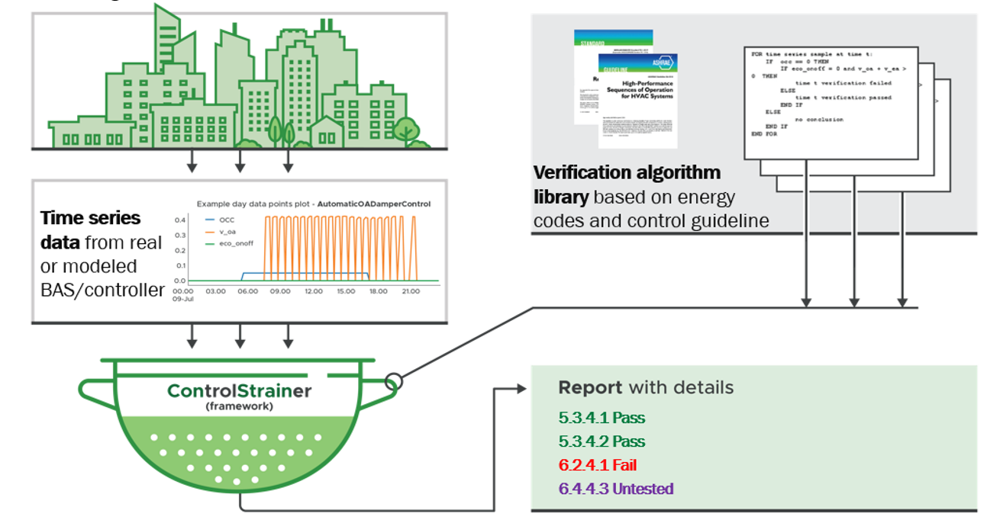

# *Con*trol *Strain*er (*ConStrain*): A Data-driven Control Performance Verification Framework (formally known as _ANIMATE_)

<!-- # ANIMATE: a dAtadriveN buildIng perforMance verificATion framEwork -->

Unit tests status: 

# Background and Motivation

Building energy modeling (BEM) has been widely used to quantify the energy impact of new building technologies, energy policy development, and other virtual demonstrations of building energy usage. Quality assurance (QA) and quality control (QC) are essential parts of such BEM analysis. This is especially true for whole-building energy modeling (BEM) which mostly deals with complex models, driven by a very large number of input data. The QA/QC approaches typically rely heavily on either simulation inputs and/or reported (summarized) outputs. While this seems like an adequate evidence at first glance, it makes the assumptions that 1) the simulation software or reference cases are free of errors, which is not always the case, and 2) there is always a unique (or set of unique) and consistent approach(es) that can be used to gauge whether simulation results are correct or not, just by reviewing inputs. In most instances, QA/QC approaches require a modeler or reviewer to spend a considerable amount of time reviewing inputs, outputs, and/or metrics to ensure that the outcome of a simulation is acceptable. Unfortunately, both 1) and 2) are rarely true because 1) simulation engines are constantly evolving (bug fixes and new features), so the reference cases might be not free of errors, and 2) time-series output verification (with a combination of summarized inputs and outputs) is the only way to ensure that models behave as expected. Reviewing only model inputs will not guarantee the model performance. To address these challenges/gaps, we propose ConStrain, a data-driven control performance verification framework that enables automatic control performance verification.

# What is _ConStrain_?

ConStrain is a framework that conducts automated output-based verification of building operations requirements. The figure below shows an overview of ConStrain and how it can be used. ConStrain was born out of the need of automating the verification of time-series data describing the behavior of building components, especially the control performance.

ConStrain is designed around three key features: building control knowledge integration, analytics, and automation. The framework includes three major components: a control performance verification algorithm library (rule-based, procedure-based, and AI-based), an automated preparation process and verification case generation, a standardized performance evaluation and reporting process.

While the development of ConStrain was motivated by use cases with building energy modeling (BEM), it can be used for other applications such as the performance verification of real buildings.

# Current Version of _ANIMATE_?

The current version of ANIMATE includes the framework implementation, a preliminary development and implementation of the verification library (based on ASHRAE 90.1-2016 and GPC36 requirement with a focus on control), and the test cases of verification algorithms using prototype building models. The current list of implemented verification algorithms includes supply air temperature control, economizer high limit, integrated economizer control, zone temperature control (dead band), zone temperature control (setback), hot water temperature reset, chilled water temperature reset, etc.

A newly released API helps users to use ConStrain more easily. An API workflow demo is provided at `demo/api_demo` and `test/api/test_workflow.py`

See the Publications section for more information and example of uses of the framework.

## Get Started

- Demos are located in `demo/`
- Visit API documentation page to learn about how to use the ConStrain API.

<!-- ## Note

- Currently the master branch is setup to run simulation and verification batches in parralel on PNNL's PIC platform. Updates are expected to properly expose setup options for different environments and use cases.

## Key files in the repository

| File                                         | Description                                                                          |
| -------------------------------------------- | ------------------------------------------------------------------------------------ |
| src/library.py                               | verification library                                                                 |
| src/run_sim_for_cases.py                     | idf file instrumenter and runner                                                     |
| src/run_verification_case.py                 | batch verification cases runner                                                      |
| src/summarize_md.py                          | batch verification cases results report generator                                    |
| src/verification_cases_split.py              | split instantiated verification cases by idf with batch size limit                   |
| schema/library.json                          | verification library meta data                                                       |
| schema/library_verification_cases.json       | library verification test cases input file (outdated)                                |
| other files in src/                          | verification framework implementation                                                |
| test_cases/                                  | verification test cases input and related files                                      |
| test_cases/verif_mtd_pp/create_test_cases.py | verification case instantiator                                                       |
| demo/verification_approach_demo              | 3 different verification methods demo outputs                                        |
| demo/library_item_demo                       | verification cases demo run in Ipython Notebook with associated case definition json | -->

## License

## Publications

- [Chen Y., J. Lerond, X. Lei, and M.I. Rosenberg. 2021. "A Knowledge-based Framework for Building Energy Model Performance Verification." In Building Simulation 2021 Conference](https://publications.ibpsa.org/conference/paper/?id=bs2021_30725)

## Referencing

If you wish to cite ConStrain in academic work please cite the above publication.

<!-- Chen Y, Lei X, Lerond J. 2021. _ANIMATE_. https://github.com/pnnl/ANIMATE. -->
