# Verification Results:

| Case No.                                       | Outcome Summary |
| ---------------------------------------------- | --------------- |

| [4364](#results-for-verification-case-id-4364) | {'Sample #': 73219, 'Pass #': 73219, 'Fail #': 0} |

| [4365](#results-for-verification-case-id-4365) | {'Sample #': 73219, 'Pass #': 73219, 'Fail #': 0} |

| [4366](#results-for-verification-case-id-4366) | {'Sample #': 73219, 'Pass #': 73219, 'Fail #': 0} |

| [4367](#results-for-verification-case-id-4367) | {'Sample #': 73219, 'Pass #': 73219, 'Fail #': 0} |

| [4368](#results-for-verification-case-id-4368) | {'Sample #': 73219, 'Pass #': 73219, 'Fail #': 0} |

| [4369](#results-for-verification-case-id-4369) | None |

| [4370](#results-for-verification-case-id-4370) | None |

| [4371](#results-for-verification-case-id-4371) | None |

| [4372](#results-for-verification-case-id-4372) | None |

| [4373](#results-for-verification-case-id-4373) | None |

| [4374](#results-for-verification-case-id-4374) | None |

| [4375](#results-for-verification-case-id-4375) | None |

| [4376](#results-for-verification-case-id-4376) | None |

| [4377](#results-for-verification-case-id-4377) | None |

| [4378](#results-for-verification-case-id-4378) | None |

| [4379](#results-for-verification-case-id-4379) | None |

| [4380](#results-for-verification-case-id-4380) | None |

| [4381](#results-for-verification-case-id-4381) | None |

| [4382](#results-for-verification-case-id-4382) | None |

| [4383](#results-for-verification-case-id-4383) | None |

| [4384](#results-for-verification-case-id-4384) | None |

| [4385](#results-for-verification-case-id-4385) | None |

| [4386](#results-for-verification-case-id-4386) | None |

| [4387](#results-for-verification-case-id-4387) | None |

| [4388](#results-for-verification-case-id-4388) | None |

| [5270](#results-for-verification-case-id-5270) | {'Sample #': 76934, 'Pass #': 76934, 'Fail #': 0} |

| [5271](#results-for-verification-case-id-5271) | {'Sample #': 76934, 'Pass #': 76934, 'Fail #': 0} |

| [5272](#results-for-verification-case-id-5272) | {'Sample #': 76934, 'Pass #': 0, 'Fail #': 76934} |

| [5273](#results-for-verification-case-id-5273) | None |

| [5274](#results-for-verification-case-id-5274) | None |

| [5275](#results-for-verification-case-id-5275) | None |

| [5276](#results-for-verification-case-id-5276) | None |

| [5277](#results-for-verification-case-id-5277) | None |

| [5278](#results-for-verification-case-id-5278) | None |

| [5279](#results-for-verification-case-id-5279) | None |

| [5280](#results-for-verification-case-id-5280) | None |

| [5281](#results-for-verification-case-id-5281) | None |

| [5282](#results-for-verification-case-id-5282) | None |

| [5283](#results-for-verification-case-id-5283) | None |

| [5284](#results-for-verification-case-id-5284) | None |


----


## Results for Verification Case ID 4364

### Pass/Fail check result
{'Sample #': 73219, 'Pass #': 73219, 'Fail #': 0}

### Result visualization

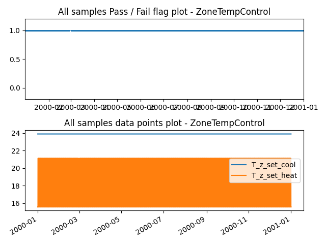


### Verification case definition
```
{
  "no": "4364",
  "run_simulation": true,
  "simulation_IO": {
    "idf": "../test_cases/verif_mtd_pp/idfs/ASHRAE901_RetailStandalone_STD2004_Atlanta.idf",
    "idd": "../resources/Energy+V9_0_1.idd",
    "weather": "../weather/USA_GA_Atlanta-Hartsfield.Jackson.Intl.AP.722190_TMY3.epw",
    "output": "eplusout.csv",
    "ep_path": "C:\\EnergyPlusV9-0-1\\energyplus.exe"
  },
  "expected_result": "pass",
  "verification_class": "ZoneTempControl",
  "datapoints_source": {
    "idf_output_variables": {
      "T_z_set_cool": {
        "subject": "Back_Space",
        "variable": "Zone Thermostat Cooling Setpoint Temperature",
        "frequency": "detailed"
      },
      "T_z_set_heat": {
        "subject": "Back_Space",
        "variable": "Zone Thermostat Heating Setpoint Temperature",
        "frequency": "detailed"
      }
    }
  },
  "library_item_id": 8,
  "description_brief": "Zone temperature setpoint deadband >= 5F (2.77C)",
  "description_detail": "Where used to control both heating and cooling, zone thermostatic controls shall be capable of and configured to provide a temperature range or dead band of at least 5\u00b0F within which the supply of heating and cooling energy to the zone is shut off or reduced to a minimum. (case study for zone temperature reset, not for this one)",
  "description_index": [
    "Section 6.4.3.1.2 in 90.1-2016"
  ],
  "description_datapoints": {
    "T_z_set_cool": "Zone cooling temperature setpoint",
    "T_z_set_heat": "Zone heating temperature setpoint"
  },
  "description_assertions": [
    "T_z_set_cool - T_z_set_heat > 5F (2.77C)"
  ],
  "description_verification_type": "rule-based",
  "assertions_type": "pass"
}
```

---


## Results for Verification Case ID 4365

### Pass/Fail check result
{'Sample #': 73219, 'Pass #': 73219, 'Fail #': 0}

### Result visualization

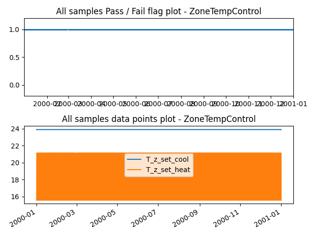


### Verification case definition
```
{
  "no": "4365",
  "run_simulation": true,
  "simulation_IO": {
    "idf": "../test_cases/verif_mtd_pp/idfs/ASHRAE901_RetailStandalone_STD2004_Atlanta.idf",
    "idd": "../resources/Energy+V9_0_1.idd",
    "weather": "../weather/USA_GA_Atlanta-Hartsfield.Jackson.Intl.AP.722190_TMY3.epw",
    "output": "eplusout.csv",
    "ep_path": "C:\\EnergyPlusV9-0-1\\energyplus.exe"
  },
  "expected_result": "pass",
  "verification_class": "ZoneTempControl",
  "datapoints_source": {
    "idf_output_variables": {
      "T_z_set_cool": {
        "subject": "Core_Retail",
        "variable": "Zone Thermostat Cooling Setpoint Temperature",
        "frequency": "detailed"
      },
      "T_z_set_heat": {
        "subject": "Core_Retail",
        "variable": "Zone Thermostat Heating Setpoint Temperature",
        "frequency": "detailed"
      }
    }
  },
  "library_item_id": 8,
  "description_brief": "Zone temperature setpoint deadband >= 5F (2.77C)",
  "description_detail": "Where used to control both heating and cooling, zone thermostatic controls shall be capable of and configured to provide a temperature range or dead band of at least 5\u00b0F within which the supply of heating and cooling energy to the zone is shut off or reduced to a minimum. (case study for zone temperature reset, not for this one)",
  "description_index": [
    "Section 6.4.3.1.2 in 90.1-2016"
  ],
  "description_datapoints": {
    "T_z_set_cool": "Zone cooling temperature setpoint",
    "T_z_set_heat": "Zone heating temperature setpoint"
  },
  "description_assertions": [
    "T_z_set_cool - T_z_set_heat > 5F (2.77C)"
  ],
  "description_verification_type": "rule-based",
  "assertions_type": "pass"
}
```

---


## Results for Verification Case ID 4366

### Pass/Fail check result
{'Sample #': 73219, 'Pass #': 73219, 'Fail #': 0}

### Result visualization


### Verification case definition
```
{
  "no": "4366",
  "run_simulation": true,
  "simulation_IO": {
    "idf": "../test_cases/verif_mtd_pp/idfs/ASHRAE901_RetailStandalone_STD2004_Atlanta.idf",
    "idd": "../resources/Energy+V9_0_1.idd",
    "weather": "../weather/USA_GA_Atlanta-Hartsfield.Jackson.Intl.AP.722190_TMY3.epw",
    "output": "eplusout.csv",
    "ep_path": "C:\\EnergyPlusV9-0-1\\energyplus.exe"
  },
  "expected_result": "pass",
  "verification_class": "ZoneTempControl",
  "datapoints_source": {
    "idf_output_variables": {
      "T_z_set_cool": {
        "subject": "Point_Of_Sale",
        "variable": "Zone Thermostat Cooling Setpoint Temperature",
        "frequency": "detailed"
      },
      "T_z_set_heat": {
        "subject": "Point_Of_Sale",
        "variable": "Zone Thermostat Heating Setpoint Temperature",
        "frequency": "detailed"
      }
    }
  },
  "library_item_id": 8,
  "description_brief": "Zone temperature setpoint deadband >= 5F (2.77C)",
  "description_detail": "Where used to control both heating and cooling, zone thermostatic controls shall be capable of and configured to provide a temperature range or dead band of at least 5\u00b0F within which the supply of heating and cooling energy to the zone is shut off or reduced to a minimum. (case study for zone temperature reset, not for this one)",
  "description_index": [
    "Section 6.4.3.1.2 in 90.1-2016"
  ],
  "description_datapoints": {
    "T_z_set_cool": "Zone cooling temperature setpoint",
    "T_z_set_heat": "Zone heating temperature setpoint"
  },
  "description_assertions": [
    "T_z_set_cool - T_z_set_heat > 5F (2.77C)"
  ],
  "description_verification_type": "rule-based",
  "assertions_type": "pass"
}
```

---


## Results for Verification Case ID 4367

### Pass/Fail check result
{'Sample #': 73219, 'Pass #': 73219, 'Fail #': 0}

### Result visualization


### Verification case definition
```
{
  "no": "4367",
  "run_simulation": true,
  "simulation_IO": {
    "idf": "../test_cases/verif_mtd_pp/idfs/ASHRAE901_RetailStandalone_STD2004_Atlanta.idf",
    "idd": "../resources/Energy+V9_0_1.idd",
    "weather": "../weather/USA_GA_Atlanta-Hartsfield.Jackson.Intl.AP.722190_TMY3.epw",
    "output": "eplusout.csv",
    "ep_path": "C:\\EnergyPlusV9-0-1\\energyplus.exe"
  },
  "expected_result": "pass",
  "verification_class": "ZoneTempControl",
  "datapoints_source": {
    "idf_output_variables": {
      "T_z_set_cool": {
        "subject": "Front_Retail",
        "variable": "Zone Thermostat Cooling Setpoint Temperature",
        "frequency": "detailed"
      },
      "T_z_set_heat": {
        "subject": "Front_Retail",
        "variable": "Zone Thermostat Heating Setpoint Temperature",
        "frequency": "detailed"
      }
    }
  },
  "library_item_id": 8,
  "description_brief": "Zone temperature setpoint deadband >= 5F (2.77C)",
  "description_detail": "Where used to control both heating and cooling, zone thermostatic controls shall be capable of and configured to provide a temperature range or dead band of at least 5\u00b0F within which the supply of heating and cooling energy to the zone is shut off or reduced to a minimum. (case study for zone temperature reset, not for this one)",
  "description_index": [
    "Section 6.4.3.1.2 in 90.1-2016"
  ],
  "description_datapoints": {
    "T_z_set_cool": "Zone cooling temperature setpoint",
    "T_z_set_heat": "Zone heating temperature setpoint"
  },
  "description_assertions": [
    "T_z_set_cool - T_z_set_heat > 5F (2.77C)"
  ],
  "description_verification_type": "rule-based",
  "assertions_type": "pass"
}
```

---


## Results for Verification Case ID 4368

### Pass/Fail check result
{'Sample #': 73219, 'Pass #': 73219, 'Fail #': 0}

### Result visualization

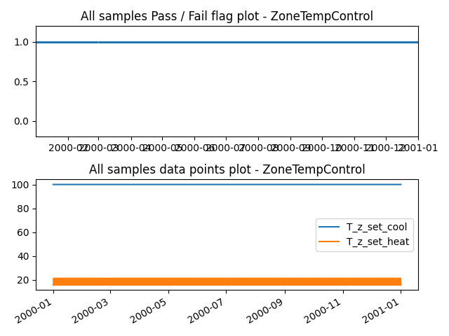


### Verification case definition
```
{
  "no": "4368",
  "run_simulation": true,
  "simulation_IO": {
    "idf": "../test_cases/verif_mtd_pp/idfs/ASHRAE901_RetailStandalone_STD2004_Atlanta.idf",
    "idd": "../resources/Energy+V9_0_1.idd",
    "weather": "../weather/USA_GA_Atlanta-Hartsfield.Jackson.Intl.AP.722190_TMY3.epw",
    "output": "eplusout.csv",
    "ep_path": "C:\\EnergyPlusV9-0-1\\energyplus.exe"
  },
  "expected_result": "pass",
  "verification_class": "ZoneTempControl",
  "datapoints_source": {
    "idf_output_variables": {
      "T_z_set_cool": {
        "subject": "Front_Entry",
        "variable": "Zone Thermostat Cooling Setpoint Temperature",
        "frequency": "detailed"
      },
      "T_z_set_heat": {
        "subject": "Front_Entry",
        "variable": "Zone Thermostat Heating Setpoint Temperature",
        "frequency": "detailed"
      }
    }
  },
  "library_item_id": 8,
  "description_brief": "Zone temperature setpoint deadband >= 5F (2.77C)",
  "description_detail": "Where used to control both heating and cooling, zone thermostatic controls shall be capable of and configured to provide a temperature range or dead band of at least 5\u00b0F within which the supply of heating and cooling energy to the zone is shut off or reduced to a minimum. (case study for zone temperature reset, not for this one)",
  "description_index": [
    "Section 6.4.3.1.2 in 90.1-2016"
  ],
  "description_datapoints": {
    "T_z_set_cool": "Zone cooling temperature setpoint",
    "T_z_set_heat": "Zone heating temperature setpoint"
  },
  "description_assertions": [
    "T_z_set_cool - T_z_set_heat > 5F (2.77C)"
  ],
  "description_verification_type": "rule-based",
  "assertions_type": "pass"
}
```

---


## Results for Verification Case ID 4369

### Pass/Fail check result
None

### Result visualization


### Verification case definition
```
{
  "no": "4369",
  "run_simulation": true,
  "simulation_IO": {
    "idf": "../test_cases/verif_mtd_pp/idfs/ASHRAE901_RetailStandalone_STD2004_Atlanta.idf",
    "idd": "../resources/Energy+V9_0_1.idd",
    "weather": "../weather/USA_GA_Atlanta-Hartsfield.Jackson.Intl.AP.722190_TMY3.epw",
    "output": "eplusout.csv",
    "ep_path": "C:\\EnergyPlusV9-0-1\\energyplus.exe"
  },
  "expected_result": "pass",
  "verification_class": "ZoneHeatingResetDepth",
  "datapoints_source": {
    "idf_output_variables": {
      "T_heat_set": {
        "subject": "Back_Space",
        "variable": "Zone Thermostat Heating Setpoint Temperature",
        "frequency": "detailed"
      }
    }
  },
  "library_item_id": 13,
  "description_brief": "Heating systems shall be equipped with controls capable of and configured to automatically restart and temporarily operate the system as required to maintain zone temperatures above an adjustable heating set point at least 10\u00b0F below (will be 60\u00b0F) the occupied heating set point. (case study)",
  "description_index": [
    "Section 6.4.3.3.2 in 90.1-2016"
  ],
  "description_datapoints": {
    "T_heat_set": "Zone Thermostat Heating Setpoint Temperature"
  },
  "description_assertions": [
    "if max(T_heat_set) - min(T_heat_set) >= 10F, then pass"
  ],
  "description_verification_type": "procedure-based",
  "assertions_type": "pass"
}
```

---


## Results for Verification Case ID 4370

### Pass/Fail check result
None

### Result visualization

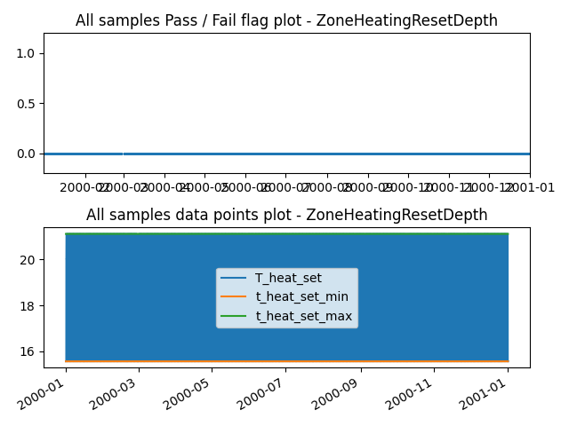


### Verification case definition
```
{
  "no": "4370",
  "run_simulation": true,
  "simulation_IO": {
    "idf": "../test_cases/verif_mtd_pp/idfs/ASHRAE901_RetailStandalone_STD2004_Atlanta.idf",
    "idd": "../resources/Energy+V9_0_1.idd",
    "weather": "../weather/USA_GA_Atlanta-Hartsfield.Jackson.Intl.AP.722190_TMY3.epw",
    "output": "eplusout.csv",
    "ep_path": "C:\\EnergyPlusV9-0-1\\energyplus.exe"
  },
  "expected_result": "pass",
  "verification_class": "ZoneHeatingResetDepth",
  "datapoints_source": {
    "idf_output_variables": {
      "T_heat_set": {
        "subject": "Core_Retail",
        "variable": "Zone Thermostat Heating Setpoint Temperature",
        "frequency": "detailed"
      }
    }
  },
  "library_item_id": 13,
  "description_brief": "Heating systems shall be equipped with controls capable of and configured to automatically restart and temporarily operate the system as required to maintain zone temperatures above an adjustable heating set point at least 10\u00b0F below (will be 60\u00b0F) the occupied heating set point. (case study)",
  "description_index": [
    "Section 6.4.3.3.2 in 90.1-2016"
  ],
  "description_datapoints": {
    "T_heat_set": "Zone Thermostat Heating Setpoint Temperature"
  },
  "description_assertions": [
    "if max(T_heat_set) - min(T_heat_set) >= 10F, then pass"
  ],
  "description_verification_type": "procedure-based",
  "assertions_type": "pass"
}
```

---


## Results for Verification Case ID 4371

### Pass/Fail check result
None

### Result visualization

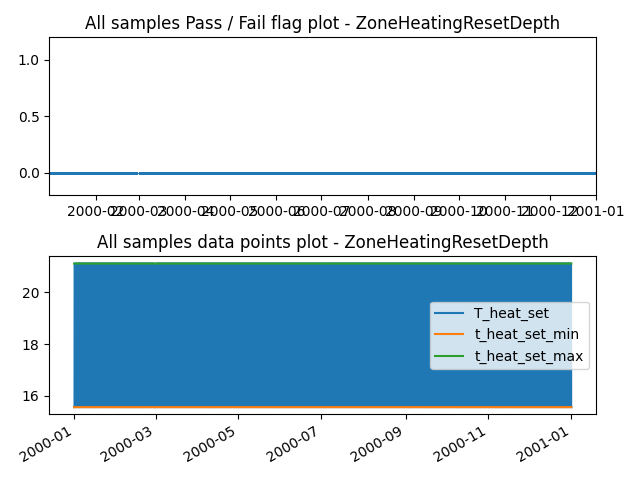


### Verification case definition
```
{
  "no": "4371",
  "run_simulation": true,
  "simulation_IO": {
    "idf": "../test_cases/verif_mtd_pp/idfs/ASHRAE901_RetailStandalone_STD2004_Atlanta.idf",
    "idd": "../resources/Energy+V9_0_1.idd",
    "weather": "../weather/USA_GA_Atlanta-Hartsfield.Jackson.Intl.AP.722190_TMY3.epw",
    "output": "eplusout.csv",
    "ep_path": "C:\\EnergyPlusV9-0-1\\energyplus.exe"
  },
  "expected_result": "pass",
  "verification_class": "ZoneHeatingResetDepth",
  "datapoints_source": {
    "idf_output_variables": {
      "T_heat_set": {
        "subject": "Point_Of_Sale",
        "variable": "Zone Thermostat Heating Setpoint Temperature",
        "frequency": "detailed"
      }
    }
  },
  "library_item_id": 13,
  "description_brief": "Heating systems shall be equipped with controls capable of and configured to automatically restart and temporarily operate the system as required to maintain zone temperatures above an adjustable heating set point at least 10\u00b0F below (will be 60\u00b0F) the occupied heating set point. (case study)",
  "description_index": [
    "Section 6.4.3.3.2 in 90.1-2016"
  ],
  "description_datapoints": {
    "T_heat_set": "Zone Thermostat Heating Setpoint Temperature"
  },
  "description_assertions": [
    "if max(T_heat_set) - min(T_heat_set) >= 10F, then pass"
  ],
  "description_verification_type": "procedure-based",
  "assertions_type": "pass"
}
```

---


## Results for Verification Case ID 4372

### Pass/Fail check result
None

### Result visualization


### Verification case definition
```
{
  "no": "4372",
  "run_simulation": true,
  "simulation_IO": {
    "idf": "../test_cases/verif_mtd_pp/idfs/ASHRAE901_RetailStandalone_STD2004_Atlanta.idf",
    "idd": "../resources/Energy+V9_0_1.idd",
    "weather": "../weather/USA_GA_Atlanta-Hartsfield.Jackson.Intl.AP.722190_TMY3.epw",
    "output": "eplusout.csv",
    "ep_path": "C:\\EnergyPlusV9-0-1\\energyplus.exe"
  },
  "expected_result": "pass",
  "verification_class": "ZoneHeatingResetDepth",
  "datapoints_source": {
    "idf_output_variables": {
      "T_heat_set": {
        "subject": "Front_Retail",
        "variable": "Zone Thermostat Heating Setpoint Temperature",
        "frequency": "detailed"
      }
    }
  },
  "library_item_id": 13,
  "description_brief": "Heating systems shall be equipped with controls capable of and configured to automatically restart and temporarily operate the system as required to maintain zone temperatures above an adjustable heating set point at least 10\u00b0F below (will be 60\u00b0F) the occupied heating set point. (case study)",
  "description_index": [
    "Section 6.4.3.3.2 in 90.1-2016"
  ],
  "description_datapoints": {
    "T_heat_set": "Zone Thermostat Heating Setpoint Temperature"
  },
  "description_assertions": [
    "if max(T_heat_set) - min(T_heat_set) >= 10F, then pass"
  ],
  "description_verification_type": "procedure-based",
  "assertions_type": "pass"
}
```

---


## Results for Verification Case ID 4373

### Pass/Fail check result
None

### Result visualization


### Verification case definition
```
{
  "no": "4373",
  "run_simulation": true,
  "simulation_IO": {
    "idf": "../test_cases/verif_mtd_pp/idfs/ASHRAE901_RetailStandalone_STD2004_Atlanta.idf",
    "idd": "../resources/Energy+V9_0_1.idd",
    "weather": "../weather/USA_GA_Atlanta-Hartsfield.Jackson.Intl.AP.722190_TMY3.epw",
    "output": "eplusout.csv",
    "ep_path": "C:\\EnergyPlusV9-0-1\\energyplus.exe"
  },
  "expected_result": "pass",
  "verification_class": "ZoneHeatingResetDepth",
  "datapoints_source": {
    "idf_output_variables": {
      "T_heat_set": {
        "subject": "Front_Entry",
        "variable": "Zone Thermostat Heating Setpoint Temperature",
        "frequency": "detailed"
      }
    }
  },
  "library_item_id": 13,
  "description_brief": "Heating systems shall be equipped with controls capable of and configured to automatically restart and temporarily operate the system as required to maintain zone temperatures above an adjustable heating set point at least 10\u00b0F below (will be 60\u00b0F) the occupied heating set point. (case study)",
  "description_index": [
    "Section 6.4.3.3.2 in 90.1-2016"
  ],
  "description_datapoints": {
    "T_heat_set": "Zone Thermostat Heating Setpoint Temperature"
  },
  "description_assertions": [
    "if max(T_heat_set) - min(T_heat_set) >= 10F, then pass"
  ],
  "description_verification_type": "procedure-based",
  "assertions_type": "pass"
}
```

---


## Results for Verification Case ID 4374

### Pass/Fail check result
None

### Result visualization


### Verification case definition
```
{
  "no": "4374",
  "run_simulation": true,
  "simulation_IO": {
    "idf": "../test_cases/verif_mtd_pp/idfs/ASHRAE901_RetailStandalone_STD2004_Atlanta.idf",
    "idd": "../resources/Energy+V9_0_1.idd",
    "weather": "../weather/USA_GA_Atlanta-Hartsfield.Jackson.Intl.AP.722190_TMY3.epw",
    "output": "eplusout.csv",
    "ep_path": "C:\\EnergyPlusV9-0-1\\energyplus.exe"
  },
  "expected_result": "pass",
  "verification_class": "ZoneCoolingResetDepth",
  "datapoints_source": {
    "idf_output_variables": {
      "T_cool_set": {
        "subject": "Back_Space",
        "variable": "Zone Thermostat Cooling Setpoint Temperature",
        "frequency": "detailed"
      }
    }
  },
  "library_item_id": 14,
  "description_brief": "Cooling systems shall be equipped with controls capable of and configured to automatically restart and temporarily operate the mechanical cooling system as required to maintain zone temperatures below an adjustable cooling set point at least 5\u00b0F above the occupied cooling set point or to prevent high space humidity levels. (case study)",
  "description_index": [
    "Section 6.4.3.3.2 in 90.1-2016"
  ],
  "description_datapoints": {
    "T_cool_set": "Zone Thermostat Cooling Setpoint Temperature"
  },
  "description_assertions": [
    "if max(T_cool_set) - min(T_cool_set) >= 5F, then pass"
  ],
  "description_verification_type": "procedure-based",
  "assertions_type": "pass"
}
```

---


## Results for Verification Case ID 4375

### Pass/Fail check result
None

### Result visualization


### Verification case definition
```
{
  "no": "4375",
  "run_simulation": true,
  "simulation_IO": {
    "idf": "../test_cases/verif_mtd_pp/idfs/ASHRAE901_RetailStandalone_STD2004_Atlanta.idf",
    "idd": "../resources/Energy+V9_0_1.idd",
    "weather": "../weather/USA_GA_Atlanta-Hartsfield.Jackson.Intl.AP.722190_TMY3.epw",
    "output": "eplusout.csv",
    "ep_path": "C:\\EnergyPlusV9-0-1\\energyplus.exe"
  },
  "expected_result": "pass",
  "verification_class": "ZoneCoolingResetDepth",
  "datapoints_source": {
    "idf_output_variables": {
      "T_cool_set": {
        "subject": "Core_Retail",
        "variable": "Zone Thermostat Cooling Setpoint Temperature",
        "frequency": "detailed"
      }
    }
  },
  "library_item_id": 14,
  "description_brief": "Cooling systems shall be equipped with controls capable of and configured to automatically restart and temporarily operate the mechanical cooling system as required to maintain zone temperatures below an adjustable cooling set point at least 5\u00b0F above the occupied cooling set point or to prevent high space humidity levels. (case study)",
  "description_index": [
    "Section 6.4.3.3.2 in 90.1-2016"
  ],
  "description_datapoints": {
    "T_cool_set": "Zone Thermostat Cooling Setpoint Temperature"
  },
  "description_assertions": [
    "if max(T_cool_set) - min(T_cool_set) >= 5F, then pass"
  ],
  "description_verification_type": "procedure-based",
  "assertions_type": "pass"
}
```

---


## Results for Verification Case ID 4376

### Pass/Fail check result
None

### Result visualization


### Verification case definition
```
{
  "no": "4376",
  "run_simulation": true,
  "simulation_IO": {
    "idf": "../test_cases/verif_mtd_pp/idfs/ASHRAE901_RetailStandalone_STD2004_Atlanta.idf",
    "idd": "../resources/Energy+V9_0_1.idd",
    "weather": "../weather/USA_GA_Atlanta-Hartsfield.Jackson.Intl.AP.722190_TMY3.epw",
    "output": "eplusout.csv",
    "ep_path": "C:\\EnergyPlusV9-0-1\\energyplus.exe"
  },
  "expected_result": "pass",
  "verification_class": "ZoneCoolingResetDepth",
  "datapoints_source": {
    "idf_output_variables": {
      "T_cool_set": {
        "subject": "Point_Of_Sale",
        "variable": "Zone Thermostat Cooling Setpoint Temperature",
        "frequency": "detailed"
      }
    }
  },
  "library_item_id": 14,
  "description_brief": "Cooling systems shall be equipped with controls capable of and configured to automatically restart and temporarily operate the mechanical cooling system as required to maintain zone temperatures below an adjustable cooling set point at least 5\u00b0F above the occupied cooling set point or to prevent high space humidity levels. (case study)",
  "description_index": [
    "Section 6.4.3.3.2 in 90.1-2016"
  ],
  "description_datapoints": {
    "T_cool_set": "Zone Thermostat Cooling Setpoint Temperature"
  },
  "description_assertions": [
    "if max(T_cool_set) - min(T_cool_set) >= 5F, then pass"
  ],
  "description_verification_type": "procedure-based",
  "assertions_type": "pass"
}
```

---


## Results for Verification Case ID 4377

### Pass/Fail check result
None

### Result visualization


### Verification case definition
```
{
  "no": "4377",
  "run_simulation": true,
  "simulation_IO": {
    "idf": "../test_cases/verif_mtd_pp/idfs/ASHRAE901_RetailStandalone_STD2004_Atlanta.idf",
    "idd": "../resources/Energy+V9_0_1.idd",
    "weather": "../weather/USA_GA_Atlanta-Hartsfield.Jackson.Intl.AP.722190_TMY3.epw",
    "output": "eplusout.csv",
    "ep_path": "C:\\EnergyPlusV9-0-1\\energyplus.exe"
  },
  "expected_result": "pass",
  "verification_class": "ZoneCoolingResetDepth",
  "datapoints_source": {
    "idf_output_variables": {
      "T_cool_set": {
        "subject": "Front_Retail",
        "variable": "Zone Thermostat Cooling Setpoint Temperature",
        "frequency": "detailed"
      }
    }
  },
  "library_item_id": 14,
  "description_brief": "Cooling systems shall be equipped with controls capable of and configured to automatically restart and temporarily operate the mechanical cooling system as required to maintain zone temperatures below an adjustable cooling set point at least 5\u00b0F above the occupied cooling set point or to prevent high space humidity levels. (case study)",
  "description_index": [
    "Section 6.4.3.3.2 in 90.1-2016"
  ],
  "description_datapoints": {
    "T_cool_set": "Zone Thermostat Cooling Setpoint Temperature"
  },
  "description_assertions": [
    "if max(T_cool_set) - min(T_cool_set) >= 5F, then pass"
  ],
  "description_verification_type": "procedure-based",
  "assertions_type": "pass"
}
```

---


## Results for Verification Case ID 4378

### Pass/Fail check result
None

### Result visualization


### Verification case definition
```
{
  "no": "4378",
  "run_simulation": true,
  "simulation_IO": {
    "idf": "../test_cases/verif_mtd_pp/idfs/ASHRAE901_RetailStandalone_STD2004_Atlanta.idf",
    "idd": "../resources/Energy+V9_0_1.idd",
    "weather": "../weather/USA_GA_Atlanta-Hartsfield.Jackson.Intl.AP.722190_TMY3.epw",
    "output": "eplusout.csv",
    "ep_path": "C:\\EnergyPlusV9-0-1\\energyplus.exe"
  },
  "expected_result": "pass",
  "verification_class": "ZoneCoolingResetDepth",
  "datapoints_source": {
    "idf_output_variables": {
      "T_cool_set": {
        "subject": "Front_Entry",
        "variable": "Zone Thermostat Cooling Setpoint Temperature",
        "frequency": "detailed"
      }
    }
  },
  "library_item_id": 14,
  "description_brief": "Cooling systems shall be equipped with controls capable of and configured to automatically restart and temporarily operate the mechanical cooling system as required to maintain zone temperatures below an adjustable cooling set point at least 5\u00b0F above the occupied cooling set point or to prevent high space humidity levels. (case study)",
  "description_index": [
    "Section 6.4.3.3.2 in 90.1-2016"
  ],
  "description_datapoints": {
    "T_cool_set": "Zone Thermostat Cooling Setpoint Temperature"
  },
  "description_assertions": [
    "if max(T_cool_set) - min(T_cool_set) >= 5F, then pass"
  ],
  "description_verification_type": "procedure-based",
  "assertions_type": "pass"
}
```

---


## Results for Verification Case ID 4379

### Pass/Fail check result
None

### Result visualization

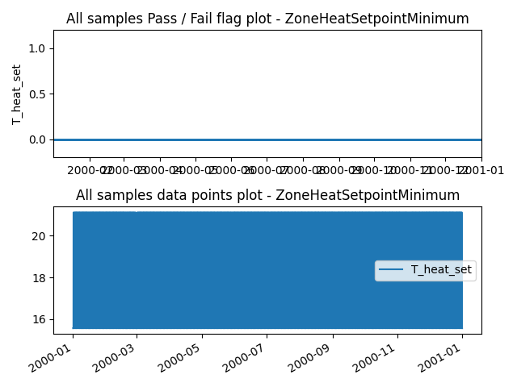


### Verification case definition
```
{
  "no": "4379",
  "run_simulation": true,
  "simulation_IO": {
    "idf": "../test_cases/verif_mtd_pp/idfs/ASHRAE901_RetailStandalone_STD2004_Atlanta.idf",
    "idd": "../resources/Energy+V9_0_1.idd",
    "weather": "../weather/USA_GA_Atlanta-Hartsfield.Jackson.Intl.AP.722190_TMY3.epw",
    "output": "eplusout.csv",
    "ep_path": "C:\\EnergyPlusV9-0-1\\energyplus.exe"
  },
  "expected_result": "pass",
  "verification_class": "ZoneHeatSetpointMinimum",
  "datapoints_source": {
    "idf_output_variables": {
      "T_heat_set": {
        "subject": "Back_Space",
        "variable": "Zone Thermostat Heating Setpoint Temperature",
        "frequency": "detailed"
      }
    }
  },
  "library_item_id": 11,
  "description_brief": "Zone heating setpoint reset temperature minimum value check",
  "description_detail": "Heating systems located in climate zones 2-8 shall be equipped with controls that have the capability to automatically restart and temporarily operate the system as required to maintain zone temperatures above a heating setpoint adjustable down to 55\u00b0F or lower. (case study)",
  "description_index": [
    "Section 6.4.3.2.2 in 90.1-2004"
  ],
  "description_datapoints": {
    "T_heat_set": "Zone Thermostat Heating Setpoint Temperature"
  },
  "description_assertions": [
    "if min(T_heat_set) <= 55F, then pass"
  ],
  "description_verification_type": "procedure-based",
  "assertions_type": "pass"
}
```

---


## Results for Verification Case ID 4380

### Pass/Fail check result
None

### Result visualization


### Verification case definition
```
{
  "no": "4380",
  "run_simulation": true,
  "simulation_IO": {
    "idf": "../test_cases/verif_mtd_pp/idfs/ASHRAE901_RetailStandalone_STD2004_Atlanta.idf",
    "idd": "../resources/Energy+V9_0_1.idd",
    "weather": "../weather/USA_GA_Atlanta-Hartsfield.Jackson.Intl.AP.722190_TMY3.epw",
    "output": "eplusout.csv",
    "ep_path": "C:\\EnergyPlusV9-0-1\\energyplus.exe"
  },
  "expected_result": "pass",
  "verification_class": "ZoneHeatSetpointMinimum",
  "datapoints_source": {
    "idf_output_variables": {
      "T_heat_set": {
        "subject": "Core_Retail",
        "variable": "Zone Thermostat Heating Setpoint Temperature",
        "frequency": "detailed"
      }
    }
  },
  "library_item_id": 11,
  "description_brief": "Zone heating setpoint reset temperature minimum value check",
  "description_detail": "Heating systems located in climate zones 2-8 shall be equipped with controls that have the capability to automatically restart and temporarily operate the system as required to maintain zone temperatures above a heating setpoint adjustable down to 55\u00b0F or lower. (case study)",
  "description_index": [
    "Section 6.4.3.2.2 in 90.1-2004"
  ],
  "description_datapoints": {
    "T_heat_set": "Zone Thermostat Heating Setpoint Temperature"
  },
  "description_assertions": [
    "if min(T_heat_set) <= 55F, then pass"
  ],
  "description_verification_type": "procedure-based",
  "assertions_type": "pass"
}
```

---


## Results for Verification Case ID 4381

### Pass/Fail check result
None

### Result visualization


### Verification case definition
```
{
  "no": "4381",
  "run_simulation": true,
  "simulation_IO": {
    "idf": "../test_cases/verif_mtd_pp/idfs/ASHRAE901_RetailStandalone_STD2004_Atlanta.idf",
    "idd": "../resources/Energy+V9_0_1.idd",
    "weather": "../weather/USA_GA_Atlanta-Hartsfield.Jackson.Intl.AP.722190_TMY3.epw",
    "output": "eplusout.csv",
    "ep_path": "C:\\EnergyPlusV9-0-1\\energyplus.exe"
  },
  "expected_result": "pass",
  "verification_class": "ZoneHeatSetpointMinimum",
  "datapoints_source": {
    "idf_output_variables": {
      "T_heat_set": {
        "subject": "Point_Of_Sale",
        "variable": "Zone Thermostat Heating Setpoint Temperature",
        "frequency": "detailed"
      }
    }
  },
  "library_item_id": 11,
  "description_brief": "Zone heating setpoint reset temperature minimum value check",
  "description_detail": "Heating systems located in climate zones 2-8 shall be equipped with controls that have the capability to automatically restart and temporarily operate the system as required to maintain zone temperatures above a heating setpoint adjustable down to 55\u00b0F or lower. (case study)",
  "description_index": [
    "Section 6.4.3.2.2 in 90.1-2004"
  ],
  "description_datapoints": {
    "T_heat_set": "Zone Thermostat Heating Setpoint Temperature"
  },
  "description_assertions": [
    "if min(T_heat_set) <= 55F, then pass"
  ],
  "description_verification_type": "procedure-based",
  "assertions_type": "pass"
}
```

---


## Results for Verification Case ID 4382

### Pass/Fail check result
None

### Result visualization


### Verification case definition
```
{
  "no": "4382",
  "run_simulation": true,
  "simulation_IO": {
    "idf": "../test_cases/verif_mtd_pp/idfs/ASHRAE901_RetailStandalone_STD2004_Atlanta.idf",
    "idd": "../resources/Energy+V9_0_1.idd",
    "weather": "../weather/USA_GA_Atlanta-Hartsfield.Jackson.Intl.AP.722190_TMY3.epw",
    "output": "eplusout.csv",
    "ep_path": "C:\\EnergyPlusV9-0-1\\energyplus.exe"
  },
  "expected_result": "pass",
  "verification_class": "ZoneHeatSetpointMinimum",
  "datapoints_source": {
    "idf_output_variables": {
      "T_heat_set": {
        "subject": "Front_Retail",
        "variable": "Zone Thermostat Heating Setpoint Temperature",
        "frequency": "detailed"
      }
    }
  },
  "library_item_id": 11,
  "description_brief": "Zone heating setpoint reset temperature minimum value check",
  "description_detail": "Heating systems located in climate zones 2-8 shall be equipped with controls that have the capability to automatically restart and temporarily operate the system as required to maintain zone temperatures above a heating setpoint adjustable down to 55\u00b0F or lower. (case study)",
  "description_index": [
    "Section 6.4.3.2.2 in 90.1-2004"
  ],
  "description_datapoints": {
    "T_heat_set": "Zone Thermostat Heating Setpoint Temperature"
  },
  "description_assertions": [
    "if min(T_heat_set) <= 55F, then pass"
  ],
  "description_verification_type": "procedure-based",
  "assertions_type": "pass"
}
```

---


## Results for Verification Case ID 4383

### Pass/Fail check result
None

### Result visualization


### Verification case definition
```
{
  "no": "4383",
  "run_simulation": true,
  "simulation_IO": {
    "idf": "../test_cases/verif_mtd_pp/idfs/ASHRAE901_RetailStandalone_STD2004_Atlanta.idf",
    "idd": "../resources/Energy+V9_0_1.idd",
    "weather": "../weather/USA_GA_Atlanta-Hartsfield.Jackson.Intl.AP.722190_TMY3.epw",
    "output": "eplusout.csv",
    "ep_path": "C:\\EnergyPlusV9-0-1\\energyplus.exe"
  },
  "expected_result": "pass",
  "verification_class": "ZoneHeatSetpointMinimum",
  "datapoints_source": {
    "idf_output_variables": {
      "T_heat_set": {
        "subject": "Front_Entry",
        "variable": "Zone Thermostat Heating Setpoint Temperature",
        "frequency": "detailed"
      }
    }
  },
  "library_item_id": 11,
  "description_brief": "Zone heating setpoint reset temperature minimum value check",
  "description_detail": "Heating systems located in climate zones 2-8 shall be equipped with controls that have the capability to automatically restart and temporarily operate the system as required to maintain zone temperatures above a heating setpoint adjustable down to 55\u00b0F or lower. (case study)",
  "description_index": [
    "Section 6.4.3.2.2 in 90.1-2004"
  ],
  "description_datapoints": {
    "T_heat_set": "Zone Thermostat Heating Setpoint Temperature"
  },
  "description_assertions": [
    "if min(T_heat_set) <= 55F, then pass"
  ],
  "description_verification_type": "procedure-based",
  "assertions_type": "pass"
}
```

---


## Results for Verification Case ID 4384

### Pass/Fail check result
None

### Result visualization


### Verification case definition
```
{
  "no": "4384",
  "run_simulation": true,
  "simulation_IO": {
    "idf": "../test_cases/verif_mtd_pp/idfs/ASHRAE901_RetailStandalone_STD2004_Atlanta.idf",
    "idd": "../resources/Energy+V9_0_1.idd",
    "weather": "../weather/USA_GA_Atlanta-Hartsfield.Jackson.Intl.AP.722190_TMY3.epw",
    "output": "eplusout.csv",
    "ep_path": "C:\\EnergyPlusV9-0-1\\energyplus.exe"
  },
  "expected_result": "pass",
  "verification_class": "ZoneCoolingSetpointMaximum",
  "datapoints_source": {
    "idf_output_variables": {
      "T_cool_set": {
        "subject": "Back_Space",
        "variable": "Zone Thermostat Cooling Setpoint Temperature",
        "frequency": "detailed"
      }
    }
  },
  "library_item_id": 12,
  "description_brief": " Cooling systems located in climate zones 1b, 2b, and 3b shall be equipped with controls that have the capability to automatically restart and temporarily operate the system as required to maintain zone temperatures below a cooling setpoint adjustable up to 90\u00b0F or higher or to prevent high space humidity levels. (case study)",
  "description_index": [
    "Section 6.4.3.2.2 in 90.1-2004"
  ],
  "description_datapoints": {
    "T_cool_set": "Zone Thermostat Cooling Setpoint Temperature"
  },
  "description_assertions": [
    "if max(T_cool_set) >= 90F, then pass"
  ],
  "description_verification_type": "procedure-based",
  "assertions_type": "pass"
}
```

---


## Results for Verification Case ID 4385

### Pass/Fail check result
None

### Result visualization

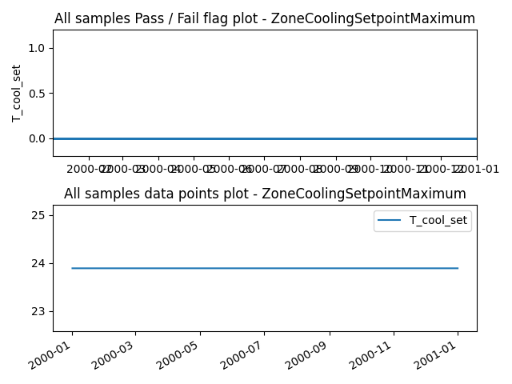


### Verification case definition
```
{
  "no": "4385",
  "run_simulation": true,
  "simulation_IO": {
    "idf": "../test_cases/verif_mtd_pp/idfs/ASHRAE901_RetailStandalone_STD2004_Atlanta.idf",
    "idd": "../resources/Energy+V9_0_1.idd",
    "weather": "../weather/USA_GA_Atlanta-Hartsfield.Jackson.Intl.AP.722190_TMY3.epw",
    "output": "eplusout.csv",
    "ep_path": "C:\\EnergyPlusV9-0-1\\energyplus.exe"
  },
  "expected_result": "pass",
  "verification_class": "ZoneCoolingSetpointMaximum",
  "datapoints_source": {
    "idf_output_variables": {
      "T_cool_set": {
        "subject": "Core_Retail",
        "variable": "Zone Thermostat Cooling Setpoint Temperature",
        "frequency": "detailed"
      }
    }
  },
  "library_item_id": 12,
  "description_brief": " Cooling systems located in climate zones 1b, 2b, and 3b shall be equipped with controls that have the capability to automatically restart and temporarily operate the system as required to maintain zone temperatures below a cooling setpoint adjustable up to 90\u00b0F or higher or to prevent high space humidity levels. (case study)",
  "description_index": [
    "Section 6.4.3.2.2 in 90.1-2004"
  ],
  "description_datapoints": {
    "T_cool_set": "Zone Thermostat Cooling Setpoint Temperature"
  },
  "description_assertions": [
    "if max(T_cool_set) >= 90F, then pass"
  ],
  "description_verification_type": "procedure-based",
  "assertions_type": "pass"
}
```

---


## Results for Verification Case ID 4386

### Pass/Fail check result
None

### Result visualization


### Verification case definition
```
{
  "no": "4386",
  "run_simulation": true,
  "simulation_IO": {
    "idf": "../test_cases/verif_mtd_pp/idfs/ASHRAE901_RetailStandalone_STD2004_Atlanta.idf",
    "idd": "../resources/Energy+V9_0_1.idd",
    "weather": "../weather/USA_GA_Atlanta-Hartsfield.Jackson.Intl.AP.722190_TMY3.epw",
    "output": "eplusout.csv",
    "ep_path": "C:\\EnergyPlusV9-0-1\\energyplus.exe"
  },
  "expected_result": "pass",
  "verification_class": "ZoneCoolingSetpointMaximum",
  "datapoints_source": {
    "idf_output_variables": {
      "T_cool_set": {
        "subject": "Point_Of_Sale",
        "variable": "Zone Thermostat Cooling Setpoint Temperature",
        "frequency": "detailed"
      }
    }
  },
  "library_item_id": 12,
  "description_brief": " Cooling systems located in climate zones 1b, 2b, and 3b shall be equipped with controls that have the capability to automatically restart and temporarily operate the system as required to maintain zone temperatures below a cooling setpoint adjustable up to 90\u00b0F or higher or to prevent high space humidity levels. (case study)",
  "description_index": [
    "Section 6.4.3.2.2 in 90.1-2004"
  ],
  "description_datapoints": {
    "T_cool_set": "Zone Thermostat Cooling Setpoint Temperature"
  },
  "description_assertions": [
    "if max(T_cool_set) >= 90F, then pass"
  ],
  "description_verification_type": "procedure-based",
  "assertions_type": "pass"
}
```

---


## Results for Verification Case ID 4387

### Pass/Fail check result
None

### Result visualization


### Verification case definition
```
{
  "no": "4387",
  "run_simulation": true,
  "simulation_IO": {
    "idf": "../test_cases/verif_mtd_pp/idfs/ASHRAE901_RetailStandalone_STD2004_Atlanta.idf",
    "idd": "../resources/Energy+V9_0_1.idd",
    "weather": "../weather/USA_GA_Atlanta-Hartsfield.Jackson.Intl.AP.722190_TMY3.epw",
    "output": "eplusout.csv",
    "ep_path": "C:\\EnergyPlusV9-0-1\\energyplus.exe"
  },
  "expected_result": "pass",
  "verification_class": "ZoneCoolingSetpointMaximum",
  "datapoints_source": {
    "idf_output_variables": {
      "T_cool_set": {
        "subject": "Front_Retail",
        "variable": "Zone Thermostat Cooling Setpoint Temperature",
        "frequency": "detailed"
      }
    }
  },
  "library_item_id": 12,
  "description_brief": " Cooling systems located in climate zones 1b, 2b, and 3b shall be equipped with controls that have the capability to automatically restart and temporarily operate the system as required to maintain zone temperatures below a cooling setpoint adjustable up to 90\u00b0F or higher or to prevent high space humidity levels. (case study)",
  "description_index": [
    "Section 6.4.3.2.2 in 90.1-2004"
  ],
  "description_datapoints": {
    "T_cool_set": "Zone Thermostat Cooling Setpoint Temperature"
  },
  "description_assertions": [
    "if max(T_cool_set) >= 90F, then pass"
  ],
  "description_verification_type": "procedure-based",
  "assertions_type": "pass"
}
```

---


## Results for Verification Case ID 4388

### Pass/Fail check result
None

### Result visualization

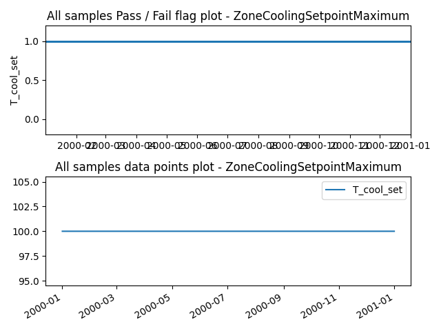


### Verification case definition
```
{
  "no": "4388",
  "run_simulation": true,
  "simulation_IO": {
    "idf": "../test_cases/verif_mtd_pp/idfs/ASHRAE901_RetailStandalone_STD2004_Atlanta.idf",
    "idd": "../resources/Energy+V9_0_1.idd",
    "weather": "../weather/USA_GA_Atlanta-Hartsfield.Jackson.Intl.AP.722190_TMY3.epw",
    "output": "eplusout.csv",
    "ep_path": "C:\\EnergyPlusV9-0-1\\energyplus.exe"
  },
  "expected_result": "pass",
  "verification_class": "ZoneCoolingSetpointMaximum",
  "datapoints_source": {
    "idf_output_variables": {
      "T_cool_set": {
        "subject": "Front_Entry",
        "variable": "Zone Thermostat Cooling Setpoint Temperature",
        "frequency": "detailed"
      }
    }
  },
  "library_item_id": 12,
  "description_brief": " Cooling systems located in climate zones 1b, 2b, and 3b shall be equipped with controls that have the capability to automatically restart and temporarily operate the system as required to maintain zone temperatures below a cooling setpoint adjustable up to 90\u00b0F or higher or to prevent high space humidity levels. (case study)",
  "description_index": [
    "Section 6.4.3.2.2 in 90.1-2004"
  ],
  "description_datapoints": {
    "T_cool_set": "Zone Thermostat Cooling Setpoint Temperature"
  },
  "description_assertions": [
    "if max(T_cool_set) >= 90F, then pass"
  ],
  "description_verification_type": "procedure-based",
  "assertions_type": "pass"
}
```

---


## Results for Verification Case ID 5270

### Pass/Fail check result
{'Sample #': 76934, 'Pass #': 76934, 'Fail #': 0}

### Result visualization

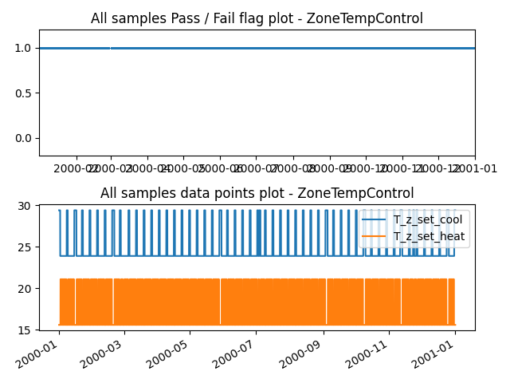


### Verification case definition
```
{
  "no": "5270",
  "run_simulation": true,
  "simulation_IO": {
    "idf": "../test_cases/verif_mtd_pp/idfs/ASHRAE901_Warehouse_STD2004_Atlanta.idf",
    "idd": "../resources/Energy+V9_0_1.idd",
    "weather": "../weather/USA_GA_Atlanta-Hartsfield.Jackson.Intl.AP.722190_TMY3.epw",
    "output": "eplusout.csv",
    "ep_path": "C:\\EnergyPlusV9-0-1\\energyplus.exe"
  },
  "expected_result": "pass",
  "verification_class": "ZoneTempControl",
  "datapoints_source": {
    "idf_output_variables": {
      "T_z_set_cool": {
        "subject": "Zone1 Office",
        "variable": "Zone Thermostat Cooling Setpoint Temperature",
        "frequency": "detailed"
      },
      "T_z_set_heat": {
        "subject": "Zone1 Office",
        "variable": "Zone Thermostat Heating Setpoint Temperature",
        "frequency": "detailed"
      }
    }
  },
  "library_item_id": 8,
  "description_brief": "Zone temperature setpoint deadband >= 5F (2.77C)",
  "description_detail": "Where used to control both heating and cooling, zone thermostatic controls shall be capable of and configured to provide a temperature range or dead band of at least 5\u00b0F within which the supply of heating and cooling energy to the zone is shut off or reduced to a minimum. (case study for zone temperature reset, not for this one)",
  "description_index": [
    "Section 6.4.3.1.2 in 90.1-2016"
  ],
  "description_datapoints": {
    "T_z_set_cool": "Zone cooling temperature setpoint",
    "T_z_set_heat": "Zone heating temperature setpoint"
  },
  "description_assertions": [
    "T_z_set_cool - T_z_set_heat > 5F (2.77C)"
  ],
  "description_verification_type": "rule-based",
  "assertions_type": "pass"
}
```

---


## Results for Verification Case ID 5271

### Pass/Fail check result
{'Sample #': 76934, 'Pass #': 76934, 'Fail #': 0}

### Result visualization

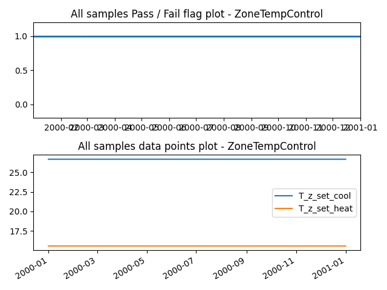


### Verification case definition
```
{
  "no": "5271",
  "run_simulation": true,
  "simulation_IO": {
    "idf": "../test_cases/verif_mtd_pp/idfs/ASHRAE901_Warehouse_STD2004_Atlanta.idf",
    "idd": "../resources/Energy+V9_0_1.idd",
    "weather": "../weather/USA_GA_Atlanta-Hartsfield.Jackson.Intl.AP.722190_TMY3.epw",
    "output": "eplusout.csv",
    "ep_path": "C:\\EnergyPlusV9-0-1\\energyplus.exe"
  },
  "expected_result": "pass",
  "verification_class": "ZoneTempControl",
  "datapoints_source": {
    "idf_output_variables": {
      "T_z_set_cool": {
        "subject": "Zone2 Fine Storage",
        "variable": "Zone Thermostat Cooling Setpoint Temperature",
        "frequency": "detailed"
      },
      "T_z_set_heat": {
        "subject": "Zone2 Fine Storage",
        "variable": "Zone Thermostat Heating Setpoint Temperature",
        "frequency": "detailed"
      }
    }
  },
  "library_item_id": 8,
  "description_brief": "Zone temperature setpoint deadband >= 5F (2.77C)",
  "description_detail": "Where used to control both heating and cooling, zone thermostatic controls shall be capable of and configured to provide a temperature range or dead band of at least 5\u00b0F within which the supply of heating and cooling energy to the zone is shut off or reduced to a minimum. (case study for zone temperature reset, not for this one)",
  "description_index": [
    "Section 6.4.3.1.2 in 90.1-2016"
  ],
  "description_datapoints": {
    "T_z_set_cool": "Zone cooling temperature setpoint",
    "T_z_set_heat": "Zone heating temperature setpoint"
  },
  "description_assertions": [
    "T_z_set_cool - T_z_set_heat > 5F (2.77C)"
  ],
  "description_verification_type": "rule-based",
  "assertions_type": "pass"
}
```

---


## Results for Verification Case ID 5272

### Pass/Fail check result
{'Sample #': 76934, 'Pass #': 0, 'Fail #': 76934}

### Result visualization

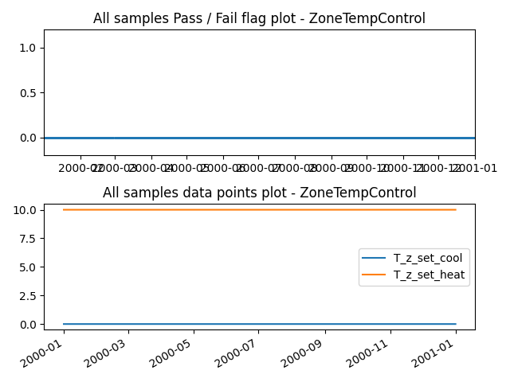


### Verification case definition
```
{
  "no": "5272",
  "run_simulation": true,
  "simulation_IO": {
    "idf": "../test_cases/verif_mtd_pp/idfs/ASHRAE901_Warehouse_STD2004_Atlanta.idf",
    "idd": "../resources/Energy+V9_0_1.idd",
    "weather": "../weather/USA_GA_Atlanta-Hartsfield.Jackson.Intl.AP.722190_TMY3.epw",
    "output": "eplusout.csv",
    "ep_path": "C:\\EnergyPlusV9-0-1\\energyplus.exe"
  },
  "expected_result": "pass",
  "verification_class": "ZoneTempControl",
  "datapoints_source": {
    "idf_output_variables": {
      "T_z_set_cool": {
        "subject": "Zone3 Bulk Storage",
        "variable": "Zone Thermostat Cooling Setpoint Temperature",
        "frequency": "detailed"
      },
      "T_z_set_heat": {
        "subject": "Zone3 Bulk Storage",
        "variable": "Zone Thermostat Heating Setpoint Temperature",
        "frequency": "detailed"
      }
    }
  },
  "library_item_id": 8,
  "description_brief": "Zone temperature setpoint deadband >= 5F (2.77C)",
  "description_detail": "Where used to control both heating and cooling, zone thermostatic controls shall be capable of and configured to provide a temperature range or dead band of at least 5\u00b0F within which the supply of heating and cooling energy to the zone is shut off or reduced to a minimum. (case study for zone temperature reset, not for this one)",
  "description_index": [
    "Section 6.4.3.1.2 in 90.1-2016"
  ],
  "description_datapoints": {
    "T_z_set_cool": "Zone cooling temperature setpoint",
    "T_z_set_heat": "Zone heating temperature setpoint"
  },
  "description_assertions": [
    "T_z_set_cool - T_z_set_heat > 5F (2.77C)"
  ],
  "description_verification_type": "rule-based",
  "assertions_type": "pass"
}
```

---


## Results for Verification Case ID 5273

### Pass/Fail check result
None

### Result visualization

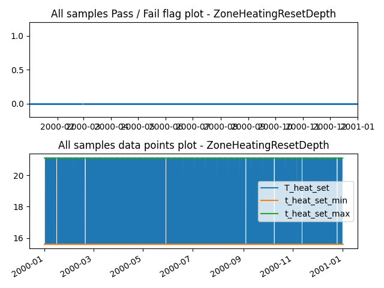


### Verification case definition
```
{
  "no": "5273",
  "run_simulation": true,
  "simulation_IO": {
    "idf": "../test_cases/verif_mtd_pp/idfs/ASHRAE901_Warehouse_STD2004_Atlanta.idf",
    "idd": "../resources/Energy+V9_0_1.idd",
    "weather": "../weather/USA_GA_Atlanta-Hartsfield.Jackson.Intl.AP.722190_TMY3.epw",
    "output": "eplusout.csv",
    "ep_path": "C:\\EnergyPlusV9-0-1\\energyplus.exe"
  },
  "expected_result": "pass",
  "verification_class": "ZoneHeatingResetDepth",
  "datapoints_source": {
    "idf_output_variables": {
      "T_heat_set": {
        "subject": "Zone1 Office",
        "variable": "Zone Thermostat Heating Setpoint Temperature",
        "frequency": "detailed"
      }
    }
  },
  "library_item_id": 13,
  "description_brief": "Heating systems shall be equipped with controls capable of and configured to automatically restart and temporarily operate the system as required to maintain zone temperatures above an adjustable heating set point at least 10\u00b0F below (will be 60\u00b0F) the occupied heating set point. (case study)",
  "description_index": [
    "Section 6.4.3.3.2 in 90.1-2016"
  ],
  "description_datapoints": {
    "T_heat_set": "Zone Thermostat Heating Setpoint Temperature"
  },
  "description_assertions": [
    "if max(T_heat_set) - min(T_heat_set) >= 10F, then pass"
  ],
  "description_verification_type": "procedure-based",
  "assertions_type": "pass"
}
```

---


## Results for Verification Case ID 5274

### Pass/Fail check result
None

### Result visualization

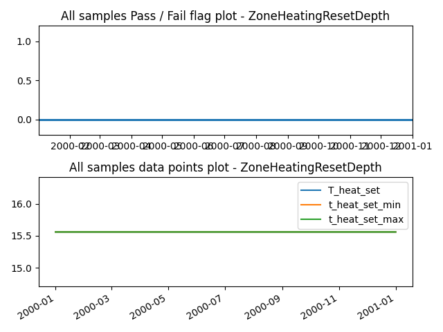


### Verification case definition
```
{
  "no": "5274",
  "run_simulation": true,
  "simulation_IO": {
    "idf": "../test_cases/verif_mtd_pp/idfs/ASHRAE901_Warehouse_STD2004_Atlanta.idf",
    "idd": "../resources/Energy+V9_0_1.idd",
    "weather": "../weather/USA_GA_Atlanta-Hartsfield.Jackson.Intl.AP.722190_TMY3.epw",
    "output": "eplusout.csv",
    "ep_path": "C:\\EnergyPlusV9-0-1\\energyplus.exe"
  },
  "expected_result": "pass",
  "verification_class": "ZoneHeatingResetDepth",
  "datapoints_source": {
    "idf_output_variables": {
      "T_heat_set": {
        "subject": "Zone2 Fine Storage",
        "variable": "Zone Thermostat Heating Setpoint Temperature",
        "frequency": "detailed"
      }
    }
  },
  "library_item_id": 13,
  "description_brief": "Heating systems shall be equipped with controls capable of and configured to automatically restart and temporarily operate the system as required to maintain zone temperatures above an adjustable heating set point at least 10\u00b0F below (will be 60\u00b0F) the occupied heating set point. (case study)",
  "description_index": [
    "Section 6.4.3.3.2 in 90.1-2016"
  ],
  "description_datapoints": {
    "T_heat_set": "Zone Thermostat Heating Setpoint Temperature"
  },
  "description_assertions": [
    "if max(T_heat_set) - min(T_heat_set) >= 10F, then pass"
  ],
  "description_verification_type": "procedure-based",
  "assertions_type": "pass"
}
```

---


## Results for Verification Case ID 5275

### Pass/Fail check result
None

### Result visualization

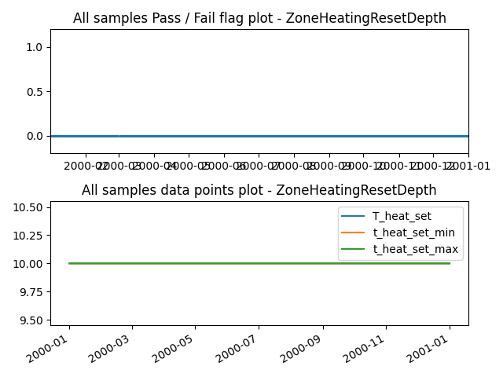


### Verification case definition
```
{
  "no": "5275",
  "run_simulation": true,
  "simulation_IO": {
    "idf": "../test_cases/verif_mtd_pp/idfs/ASHRAE901_Warehouse_STD2004_Atlanta.idf",
    "idd": "../resources/Energy+V9_0_1.idd",
    "weather": "../weather/USA_GA_Atlanta-Hartsfield.Jackson.Intl.AP.722190_TMY3.epw",
    "output": "eplusout.csv",
    "ep_path": "C:\\EnergyPlusV9-0-1\\energyplus.exe"
  },
  "expected_result": "pass",
  "verification_class": "ZoneHeatingResetDepth",
  "datapoints_source": {
    "idf_output_variables": {
      "T_heat_set": {
        "subject": "Zone3 Bulk Storage",
        "variable": "Zone Thermostat Heating Setpoint Temperature",
        "frequency": "detailed"
      }
    }
  },
  "library_item_id": 13,
  "description_brief": "Heating systems shall be equipped with controls capable of and configured to automatically restart and temporarily operate the system as required to maintain zone temperatures above an adjustable heating set point at least 10\u00b0F below (will be 60\u00b0F) the occupied heating set point. (case study)",
  "description_index": [
    "Section 6.4.3.3.2 in 90.1-2016"
  ],
  "description_datapoints": {
    "T_heat_set": "Zone Thermostat Heating Setpoint Temperature"
  },
  "description_assertions": [
    "if max(T_heat_set) - min(T_heat_set) >= 10F, then pass"
  ],
  "description_verification_type": "procedure-based",
  "assertions_type": "pass"
}
```

---


## Results for Verification Case ID 5276

### Pass/Fail check result
None

### Result visualization

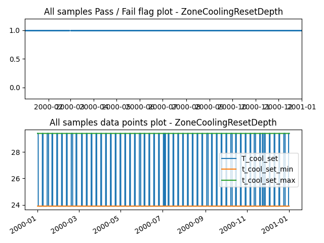


### Verification case definition
```
{
  "no": "5276",
  "run_simulation": true,
  "simulation_IO": {
    "idf": "../test_cases/verif_mtd_pp/idfs/ASHRAE901_Warehouse_STD2004_Atlanta.idf",
    "idd": "../resources/Energy+V9_0_1.idd",
    "weather": "../weather/USA_GA_Atlanta-Hartsfield.Jackson.Intl.AP.722190_TMY3.epw",
    "output": "eplusout.csv",
    "ep_path": "C:\\EnergyPlusV9-0-1\\energyplus.exe"
  },
  "expected_result": "pass",
  "verification_class": "ZoneCoolingResetDepth",
  "datapoints_source": {
    "idf_output_variables": {
      "T_cool_set": {
        "subject": "Zone1 Office",
        "variable": "Zone Thermostat Cooling Setpoint Temperature",
        "frequency": "detailed"
      }
    }
  },
  "library_item_id": 14,
  "description_brief": "Cooling systems shall be equipped with controls capable of and configured to automatically restart and temporarily operate the mechanical cooling system as required to maintain zone temperatures below an adjustable cooling set point at least 5\u00b0F above the occupied cooling set point or to prevent high space humidity levels. (case study)",
  "description_index": [
    "Section 6.4.3.3.2 in 90.1-2016"
  ],
  "description_datapoints": {
    "T_cool_set": "Zone Thermostat Cooling Setpoint Temperature"
  },
  "description_assertions": [
    "if max(T_cool_set) - min(T_cool_set) >= 5F, then pass"
  ],
  "description_verification_type": "procedure-based",
  "assertions_type": "pass"
}
```

---


## Results for Verification Case ID 5277

### Pass/Fail check result
None

### Result visualization

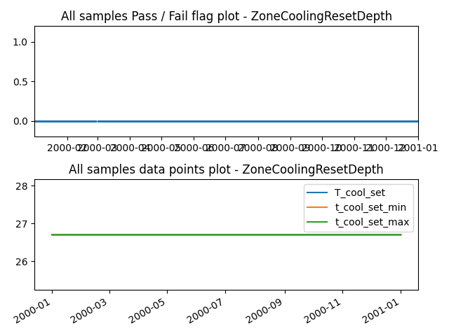


### Verification case definition
```
{
  "no": "5277",
  "run_simulation": true,
  "simulation_IO": {
    "idf": "../test_cases/verif_mtd_pp/idfs/ASHRAE901_Warehouse_STD2004_Atlanta.idf",
    "idd": "../resources/Energy+V9_0_1.idd",
    "weather": "../weather/USA_GA_Atlanta-Hartsfield.Jackson.Intl.AP.722190_TMY3.epw",
    "output": "eplusout.csv",
    "ep_path": "C:\\EnergyPlusV9-0-1\\energyplus.exe"
  },
  "expected_result": "pass",
  "verification_class": "ZoneCoolingResetDepth",
  "datapoints_source": {
    "idf_output_variables": {
      "T_cool_set": {
        "subject": "Zone2 Fine Storage",
        "variable": "Zone Thermostat Cooling Setpoint Temperature",
        "frequency": "detailed"
      }
    }
  },
  "library_item_id": 14,
  "description_brief": "Cooling systems shall be equipped with controls capable of and configured to automatically restart and temporarily operate the mechanical cooling system as required to maintain zone temperatures below an adjustable cooling set point at least 5\u00b0F above the occupied cooling set point or to prevent high space humidity levels. (case study)",
  "description_index": [
    "Section 6.4.3.3.2 in 90.1-2016"
  ],
  "description_datapoints": {
    "T_cool_set": "Zone Thermostat Cooling Setpoint Temperature"
  },
  "description_assertions": [
    "if max(T_cool_set) - min(T_cool_set) >= 5F, then pass"
  ],
  "description_verification_type": "procedure-based",
  "assertions_type": "pass"
}
```

---


## Results for Verification Case ID 5278

### Pass/Fail check result
None

### Result visualization

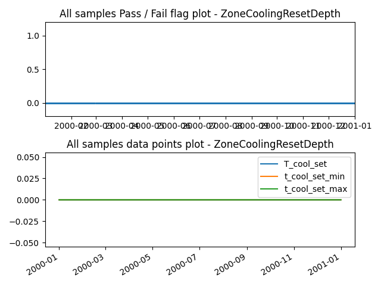


### Verification case definition
```
{
  "no": "5278",
  "run_simulation": true,
  "simulation_IO": {
    "idf": "../test_cases/verif_mtd_pp/idfs/ASHRAE901_Warehouse_STD2004_Atlanta.idf",
    "idd": "../resources/Energy+V9_0_1.idd",
    "weather": "../weather/USA_GA_Atlanta-Hartsfield.Jackson.Intl.AP.722190_TMY3.epw",
    "output": "eplusout.csv",
    "ep_path": "C:\\EnergyPlusV9-0-1\\energyplus.exe"
  },
  "expected_result": "pass",
  "verification_class": "ZoneCoolingResetDepth",
  "datapoints_source": {
    "idf_output_variables": {
      "T_cool_set": {
        "subject": "Zone3 Bulk Storage",
        "variable": "Zone Thermostat Cooling Setpoint Temperature",
        "frequency": "detailed"
      }
    }
  },
  "library_item_id": 14,
  "description_brief": "Cooling systems shall be equipped with controls capable of and configured to automatically restart and temporarily operate the mechanical cooling system as required to maintain zone temperatures below an adjustable cooling set point at least 5\u00b0F above the occupied cooling set point or to prevent high space humidity levels. (case study)",
  "description_index": [
    "Section 6.4.3.3.2 in 90.1-2016"
  ],
  "description_datapoints": {
    "T_cool_set": "Zone Thermostat Cooling Setpoint Temperature"
  },
  "description_assertions": [
    "if max(T_cool_set) - min(T_cool_set) >= 5F, then pass"
  ],
  "description_verification_type": "procedure-based",
  "assertions_type": "pass"
}
```

---


## Results for Verification Case ID 5279

### Pass/Fail check result
None

### Result visualization


### Verification case definition
```
{
  "no": "5279",
  "run_simulation": true,
  "simulation_IO": {
    "idf": "../test_cases/verif_mtd_pp/idfs/ASHRAE901_Warehouse_STD2004_Atlanta.idf",
    "idd": "../resources/Energy+V9_0_1.idd",
    "weather": "../weather/USA_GA_Atlanta-Hartsfield.Jackson.Intl.AP.722190_TMY3.epw",
    "output": "eplusout.csv",
    "ep_path": "C:\\EnergyPlusV9-0-1\\energyplus.exe"
  },
  "expected_result": "pass",
  "verification_class": "ZoneHeatSetpointMinimum",
  "datapoints_source": {
    "idf_output_variables": {
      "T_heat_set": {
        "subject": "Zone1 Office",
        "variable": "Zone Thermostat Heating Setpoint Temperature",
        "frequency": "detailed"
      }
    }
  },
  "library_item_id": 11,
  "description_brief": "Zone heating setpoint reset temperature minimum value check",
  "description_detail": "Heating systems located in climate zones 2-8 shall be equipped with controls that have the capability to automatically restart and temporarily operate the system as required to maintain zone temperatures above a heating setpoint adjustable down to 55\u00b0F or lower. (case study)",
  "description_index": [
    "Section 6.4.3.2.2 in 90.1-2004"
  ],
  "description_datapoints": {
    "T_heat_set": "Zone Thermostat Heating Setpoint Temperature"
  },
  "description_assertions": [
    "if min(T_heat_set) <= 55F, then pass"
  ],
  "description_verification_type": "procedure-based",
  "assertions_type": "pass"
}
```

---


## Results for Verification Case ID 5280

### Pass/Fail check result
None

### Result visualization

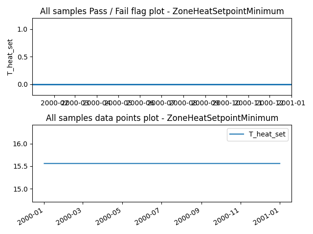


### Verification case definition
```
{
  "no": "5280",
  "run_simulation": true,
  "simulation_IO": {
    "idf": "../test_cases/verif_mtd_pp/idfs/ASHRAE901_Warehouse_STD2004_Atlanta.idf",
    "idd": "../resources/Energy+V9_0_1.idd",
    "weather": "../weather/USA_GA_Atlanta-Hartsfield.Jackson.Intl.AP.722190_TMY3.epw",
    "output": "eplusout.csv",
    "ep_path": "C:\\EnergyPlusV9-0-1\\energyplus.exe"
  },
  "expected_result": "pass",
  "verification_class": "ZoneHeatSetpointMinimum",
  "datapoints_source": {
    "idf_output_variables": {
      "T_heat_set": {
        "subject": "Zone2 Fine Storage",
        "variable": "Zone Thermostat Heating Setpoint Temperature",
        "frequency": "detailed"
      }
    }
  },
  "library_item_id": 11,
  "description_brief": "Zone heating setpoint reset temperature minimum value check",
  "description_detail": "Heating systems located in climate zones 2-8 shall be equipped with controls that have the capability to automatically restart and temporarily operate the system as required to maintain zone temperatures above a heating setpoint adjustable down to 55\u00b0F or lower. (case study)",
  "description_index": [
    "Section 6.4.3.2.2 in 90.1-2004"
  ],
  "description_datapoints": {
    "T_heat_set": "Zone Thermostat Heating Setpoint Temperature"
  },
  "description_assertions": [
    "if min(T_heat_set) <= 55F, then pass"
  ],
  "description_verification_type": "procedure-based",
  "assertions_type": "pass"
}
```

---


## Results for Verification Case ID 5281

### Pass/Fail check result
None

### Result visualization

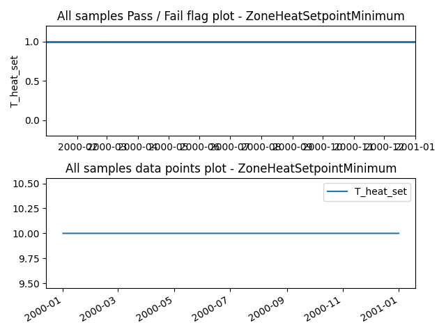


### Verification case definition
```
{
  "no": "5281",
  "run_simulation": true,
  "simulation_IO": {
    "idf": "../test_cases/verif_mtd_pp/idfs/ASHRAE901_Warehouse_STD2004_Atlanta.idf",
    "idd": "../resources/Energy+V9_0_1.idd",
    "weather": "../weather/USA_GA_Atlanta-Hartsfield.Jackson.Intl.AP.722190_TMY3.epw",
    "output": "eplusout.csv",
    "ep_path": "C:\\EnergyPlusV9-0-1\\energyplus.exe"
  },
  "expected_result": "pass",
  "verification_class": "ZoneHeatSetpointMinimum",
  "datapoints_source": {
    "idf_output_variables": {
      "T_heat_set": {
        "subject": "Zone3 Bulk Storage",
        "variable": "Zone Thermostat Heating Setpoint Temperature",
        "frequency": "detailed"
      }
    }
  },
  "library_item_id": 11,
  "description_brief": "Zone heating setpoint reset temperature minimum value check",
  "description_detail": "Heating systems located in climate zones 2-8 shall be equipped with controls that have the capability to automatically restart and temporarily operate the system as required to maintain zone temperatures above a heating setpoint adjustable down to 55\u00b0F or lower. (case study)",
  "description_index": [
    "Section 6.4.3.2.2 in 90.1-2004"
  ],
  "description_datapoints": {
    "T_heat_set": "Zone Thermostat Heating Setpoint Temperature"
  },
  "description_assertions": [
    "if min(T_heat_set) <= 55F, then pass"
  ],
  "description_verification_type": "procedure-based",
  "assertions_type": "pass"
}
```

---


## Results for Verification Case ID 5282

### Pass/Fail check result
None

### Result visualization

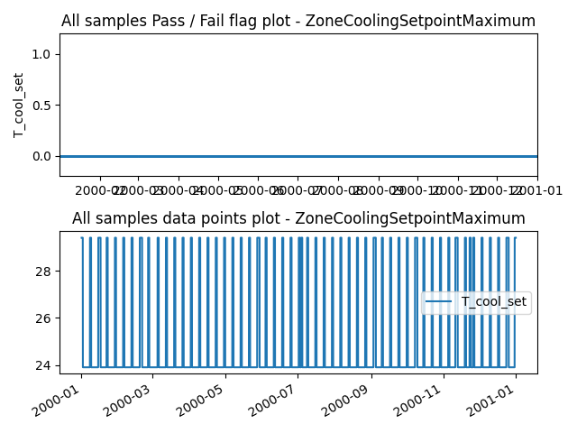


### Verification case definition
```
{
  "no": "5282",
  "run_simulation": true,
  "simulation_IO": {
    "idf": "../test_cases/verif_mtd_pp/idfs/ASHRAE901_Warehouse_STD2004_Atlanta.idf",
    "idd": "../resources/Energy+V9_0_1.idd",
    "weather": "../weather/USA_GA_Atlanta-Hartsfield.Jackson.Intl.AP.722190_TMY3.epw",
    "output": "eplusout.csv",
    "ep_path": "C:\\EnergyPlusV9-0-1\\energyplus.exe"
  },
  "expected_result": "pass",
  "verification_class": "ZoneCoolingSetpointMaximum",
  "datapoints_source": {
    "idf_output_variables": {
      "T_cool_set": {
        "subject": "Zone1 Office",
        "variable": "Zone Thermostat Cooling Setpoint Temperature",
        "frequency": "detailed"
      }
    }
  },
  "library_item_id": 12,
  "description_brief": " Cooling systems located in climate zones 1b, 2b, and 3b shall be equipped with controls that have the capability to automatically restart and temporarily operate the system as required to maintain zone temperatures below a cooling setpoint adjustable up to 90\u00b0F or higher or to prevent high space humidity levels. (case study)",
  "description_index": [
    "Section 6.4.3.2.2 in 90.1-2004"
  ],
  "description_datapoints": {
    "T_cool_set": "Zone Thermostat Cooling Setpoint Temperature"
  },
  "description_assertions": [
    "if max(T_cool_set) >= 90F, then pass"
  ],
  "description_verification_type": "procedure-based",
  "assertions_type": "pass"
}
```

---


## Results for Verification Case ID 5283

### Pass/Fail check result
None

### Result visualization

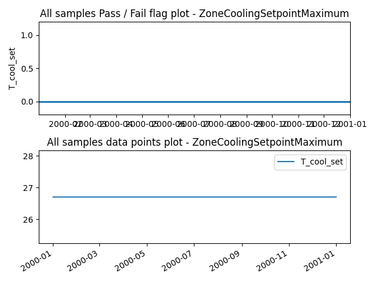


### Verification case definition
```
{
  "no": "5283",
  "run_simulation": true,
  "simulation_IO": {
    "idf": "../test_cases/verif_mtd_pp/idfs/ASHRAE901_Warehouse_STD2004_Atlanta.idf",
    "idd": "../resources/Energy+V9_0_1.idd",
    "weather": "../weather/USA_GA_Atlanta-Hartsfield.Jackson.Intl.AP.722190_TMY3.epw",
    "output": "eplusout.csv",
    "ep_path": "C:\\EnergyPlusV9-0-1\\energyplus.exe"
  },
  "expected_result": "pass",
  "verification_class": "ZoneCoolingSetpointMaximum",
  "datapoints_source": {
    "idf_output_variables": {
      "T_cool_set": {
        "subject": "Zone2 Fine Storage",
        "variable": "Zone Thermostat Cooling Setpoint Temperature",
        "frequency": "detailed"
      }
    }
  },
  "library_item_id": 12,
  "description_brief": " Cooling systems located in climate zones 1b, 2b, and 3b shall be equipped with controls that have the capability to automatically restart and temporarily operate the system as required to maintain zone temperatures below a cooling setpoint adjustable up to 90\u00b0F or higher or to prevent high space humidity levels. (case study)",
  "description_index": [
    "Section 6.4.3.2.2 in 90.1-2004"
  ],
  "description_datapoints": {
    "T_cool_set": "Zone Thermostat Cooling Setpoint Temperature"
  },
  "description_assertions": [
    "if max(T_cool_set) >= 90F, then pass"
  ],
  "description_verification_type": "procedure-based",
  "assertions_type": "pass"
}
```

---


## Results for Verification Case ID 5284

### Pass/Fail check result
None

### Result visualization

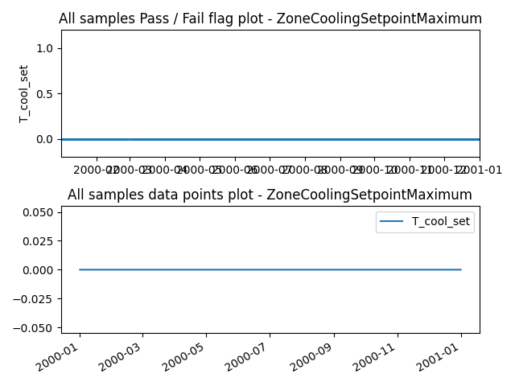


### Verification case definition
```
{
  "no": "5284",
  "run_simulation": true,
  "simulation_IO": {
    "idf": "../test_cases/verif_mtd_pp/idfs/ASHRAE901_Warehouse_STD2004_Atlanta.idf",
    "idd": "../resources/Energy+V9_0_1.idd",
    "weather": "../weather/USA_GA_Atlanta-Hartsfield.Jackson.Intl.AP.722190_TMY3.epw",
    "output": "eplusout.csv",
    "ep_path": "C:\\EnergyPlusV9-0-1\\energyplus.exe"
  },
  "expected_result": "pass",
  "verification_class": "ZoneCoolingSetpointMaximum",
  "datapoints_source": {
    "idf_output_variables": {
      "T_cool_set": {
        "subject": "Zone3 Bulk Storage",
        "variable": "Zone Thermostat Cooling Setpoint Temperature",
        "frequency": "detailed"
      }
    }
  },
  "library_item_id": 12,
  "description_brief": " Cooling systems located in climate zones 1b, 2b, and 3b shall be equipped with controls that have the capability to automatically restart and temporarily operate the system as required to maintain zone temperatures below a cooling setpoint adjustable up to 90\u00b0F or higher or to prevent high space humidity levels. (case study)",
  "description_index": [
    "Section 6.4.3.2.2 in 90.1-2004"
  ],
  "description_datapoints": {
    "T_cool_set": "Zone Thermostat Cooling Setpoint Temperature"
  },
  "description_assertions": [
    "if max(T_cool_set) >= 90F, then pass"
  ],
  "description_verification_type": "procedure-based",
  "assertions_type": "pass"
}
```

---

